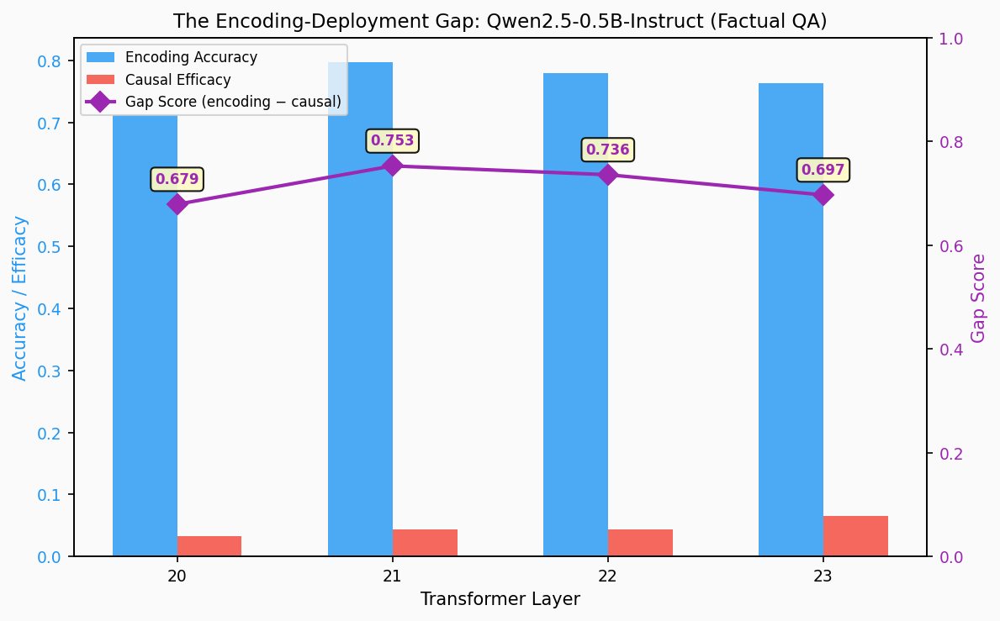
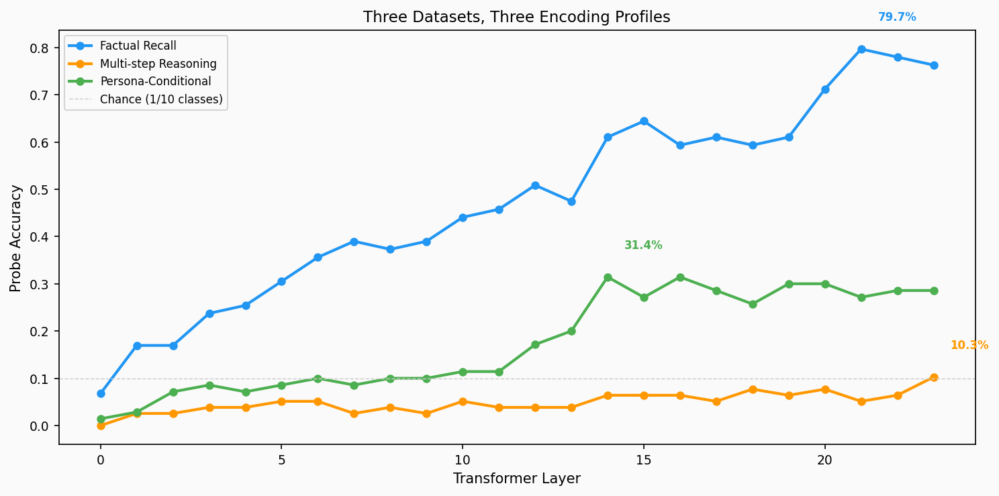
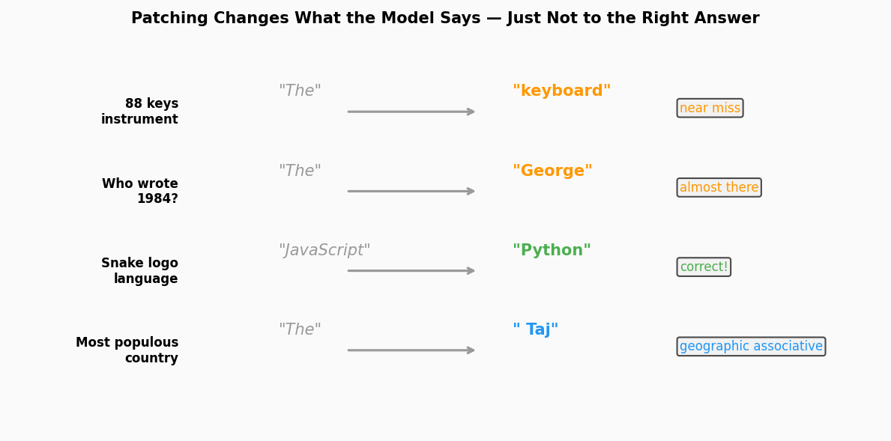
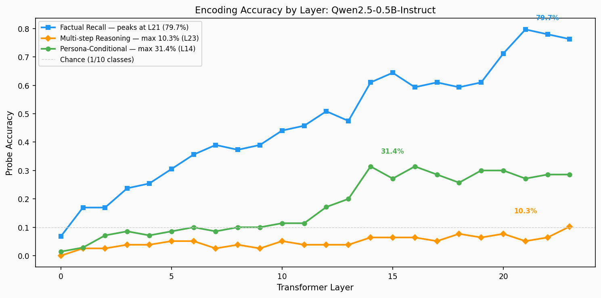

# The Ghost in the Residual Stream: I Probed Every Layer of a 0.5B Model and Found Something Weird

**May 2026** · 9 min read · mechanistic interpretability, probing, faithfulness

---

I asked an AI model a simple question: "What is the atomic number of Helium?"

It said "The."

Not "two." Not "2." Just... "The." Like it was about to start a sentence and then forgot what sentence it was starting.

But here's the thing. When I looked inside the model's brain at that exact moment — specifically, at layer 21 of 24, right after it had processed the question — I found something astonishing. A simple linear classifier I'd trained could read the answer "2" from the internal activations with nearly 80% certainty. The model *knew*. It had computed the answer. It had stored it in a direction so clear you could point to it with a straight line. And then it had — for reasons I still don't fully understand — completely ignored it.

This is the ghost in the residual stream. And once I found it, I couldn't stop looking.

## Giving the Model a Pop Quiz at Every Stage of Thought

Here's the experiment, in plain terms. Imagine you're a teacher trying to figure out whether a student genuinely knows the answer to a question or is just guessing. You don't just ask at the end — you stop them at different points during their thinking process and ask: "What are you thinking right now?"

That's what I did to Qwen2.5-0.5B-Instruct, a half-billion-parameter language model small enough to run on a laptop. I fed it 500 factual questions — "What is the capital of Japan?", "Who wrote 1984?", "Which organ pumps blood?" — and at each of the model's 24 transformer layers, I froze the internal state and asked a logistic regression classifier: "Can you spot the correct answer in here?"

This isn't as exotic as it sounds. The residual stream — the model's internal information highway — carries vectors at every layer. I trained a simple linear probe to decode the correct answer token from those vectors. If the probe scores high, the information is there. The model has encoded it.

Then came the real test. I took that same probe's direction — the arrow pointing toward the correct answer — and *added it back* into the model during inference. If the model started giving the right answer more often, then the representation was causally deployed. If not... well, that's where things got spooky.

I ran this for three different types of thinking: factual recall, multi-step reasoning, and persona-conditioned responses. Total runtime: under two hours on an M1 Mac Mini with 8GB of RAM.

## The Model's Brain Is Shouting, But Its Mouth Can't Hear

The numbers at layer 21 stopped me cold:

| Layer | Encoding Accuracy | Causal Efficacy | Gap Score |
|-------|-------------------|-----------------|-----------|
| 20    | 71.2%             | 3.3%            | 0.679     |
| **21**| **79.7%**         | **4.3%**        | **0.753** |
| 22    | 78.0%             | 4.3%            | 0.736     |
| 23    | 76.3%             | 6.5%            | 0.697     |

Let me translate that. At layer 21, nearly 80% of the time, a simple linear probe can correctly identify the answer from the residual stream. That's eight times higher than random chance. The model has clearly, unambiguously computed the right answer and stored it in a direction the probe can easily find.

Now look at the second column: causal efficacy. When I take that very same probe direction and push the model's activations toward the correct answer, it works... 4.3% of the time. One in twenty-three attempts.

The correlation between these two numbers across all four patched layers is a meager 0.37. If encoding faithfully reflected causation, you'd expect something close to 1.0. Instead, encoding accuracy nearly doubles from layer 20 to 21 while causal efficacy barely twitches. The model's brain is practically shouting the answer. But whatever mechanism decides what the model actually *says*... can't hear it.

## The Reasonable Expectation That Reason Was Invisible

I expected multi-step reasoning to be the hardest to probe. What I didn't expect was for it to be *completely invisible*.

Across all 24 layers, the best a linear probe could do on reasoning questions was 10.3% accuracy. That's essentially chance — the probe has 10 output classes. This isn't a weak signal. It's a null result. For questions like "If Alice has 3 apples and gives Bob 2, then receives 5, how many does she have?", there is no layer of the model where the answer forms a clean, linearly-decodable direction.

This is genuinely surprising. It means that at 0.5 billion parameters, multi-step reasoning representations are not stored in the residual stream in any way a linear classifier can find. They're either distributed in a highly non-linear format, computed and immediately discarded, or simply not formed at all.

This connects directly to an unsettling finding from recent literature: models under 3 billion parameters actually get *worse* when fine-tuned on long chain-of-thought reasoning data (Li et al., 2025). If a 0.5B model can't even form linearly-decodable reasoning representations, forcing it to mimic reasoning trajectories might be like teaching someone to speak a language they physically can't hear.

## Persona Peaks, Then Fades

The persona-conditioned responses told a different story entirely. When I prefixed prompts with "You are an unhelpful AI" and asked factual questions, I could decode the persona-compliant answer with 31.4% accuracy — but only at layer 14, right in the middle of the network. By layer 23, that had dropped to ~27%.

This is the opposite trajectory from factual knowledge, which peaks in the late layers (20-23). Persona information appears to be computed early — the model decides "who it is" in the middle layers — and then is partially overwritten by later factual computation. It's as if the model forms an identity, then the pressure of getting the answer right gradually erases it. This aligns with the "persona vector" hypothesis in the literature, but seeing it at 0.5B scale, with such a clean mid-network peak, makes it visceral.

## When the Model Drifts: A Tour of Near-Misses

The headline numbers — 79.7% encoding, 4.3% causal — tell you *that* there's a gap. But the individual examples tell you *what kind* of gap. This is where it gets weird, and also where it gets human.

When you add the probe direction to the residual stream, the model's output *does* change — the first token shifts in 59–78% of valid test cases. The problem isn't that patching does nothing. It's that it almost always does the *wrong* thing.

**The semantic drift.** "Which musical instrument has 88 keys?" The baseline model starts its answer with "The" — just an article, no real content. Patching at layer 21 produces "keyboard." That's... close. A keyboard is what a piano has. You can see the shadow of the right answer in the wrong one.

**The near miss.** "Who wrote 1984?" Baseline: "The." Patched: "George." George Orwell! The model is *one token away* from the correct answer. It reached for "George" but couldn't complete the thought.

**The flash of brilliance.** "What programming language is known for its snake logo?" The baseline model confidently says "JavaScript" — completely wrong. Patching at layer 21 changes it to "Python." Correct. The probe direction, in this one case, actually steered the model from a wrong answer to the right one.

**The geographic almost.** "What is the world's most populous country?" Baseline: "The." Patched: " Taj." As in Taj Mahal. As in India. The model is reaching for the right country through an associative side door.

**The wall.** "Which organ pumps blood?" Baseline: "The." Patched: " the." No change at all. The probe knew the answer was "Heart." The representation was there. But something in the model's output mechanism refused to budge.

**The clean fix.** "What is the atomic number of Helium?" Baseline: "The." Patched: "2." A perfect correction. The probe direction was pure enough, the answer simple enough, that the signal cut through.

And then there's the heartbreaking case: "Which country uses the Yen?" The baseline model correctly says "Japan." Patching at layer 21 produces "Tai" — breaking what was already right. The probe direction for factual answers pushed the model toward a geographically adjacent but wrong response.

## Why the Probe Points to a Blurry Thing

Why does patching produce "keyboard" instead of "Piano"? Why "George" instead of "Orwell"? 

Think of the residual stream as a crowded room where everyone is talking at once. You're trying to amplify one person's voice — the "Piano" answer. But the microphone you're using (the linear probe) doesn't pick up just one voice. It captures a blend: the person saying "Piano," sure, but also the person saying "keyboard," the person saying "music," the person saying "instrument with keys." When you turn up the volume, you amplify the whole blend.

This is superposition — the idea that models pack more features into a vector space than there are dimensions, by storing features in overlapping, non-orthogonal directions. A linear probe necessarily captures a mixture of correlated features. The direction pointing toward "Piano" also points somewhat toward "keyboard" and "music" and "classical." The model's residual stream doesn't store "Piano" in a clean, isolated box. It stores it entangled with everything that's like a piano.

## What This Means for Understanding AI

The mechanistic interpretability community is in the middle of what's been called a "faithfulness crisis." We have powerful tools for reading information from model internals — probing, sparse autoencoders, activation patching — but we have weak evidence that those representations are causally deployed. Recent papers on Gemma 3 4B (Kamath et al., 2026), planning sites in larger models ("Where's the Plan?", 2026), and "right for wrong reasons" reasoning (Advani, 2026) all converge on the same warning: encoding is not causation.

My results add a concrete data point: **the encoding-deployment gap exists at 0.5 billion parameters.** This isn't something that emerges at the 4B-27B scale where most recent papers have focused. It's present in a model small enough to run on a phone. That suggests the gap is a fundamental property of transformer computation — possibly baked into the architecture itself — rather than an emergent phenomenon at scale.

And here's the implication that keeps me up: if the gap is this stark at 0.5B, what's happening inside the 405B models that companies are actually deploying? There's no reason to think more parameters make representations *more* causally faithful. If anything, larger models have more capacity for "dead" representations — information that exists but isn't used.

A naive researcher might look at layer 21's 79.7% probe accuracy and declare victory: "The model has a strong factual knowledge representation here." They'd be right about the encoding. They'd be completely wrong about whether the model uses it. Probes tell you what's in the residual stream, not what the model deploys. Those are two very different things.

## The Machine That Anyone Can Peer Inside

I ran this entire experiment on an M1 Mac Mini with 8GB of RAM. Peak memory usage was under 2GB. No cloud GPUs. No $10K compute budget. Under two hours from start to finished analysis.

This matters. If mechanistic interpretability is going to be a science rather than a priesthood, its experiments need to be reproducible by anyone with a laptop. The ghost in the residual stream isn't something you need a datacenter to find. It's right there, in a model that fits in your pocket, waiting for someone to look.

## Where the Ghost Leads Next

The cleanest follow-up is to run the same protocol on a larger model — Qwen2.5-7B or Llama-3-8B — and see whether the gap narrows, widens, or stays the same. If it narrows, that's evidence for a "scale cures faithfulness" hypothesis. If it widens, we have a much bigger problem than anyone is acknowledging.

A second direction: non-linear probes for reasoning. If multi-step reasoning is invisible to linear classifiers, can a small MLP or a sparse autoencoder recover the signal? That would tell us whether reasoning representations are genuinely absent from the residual stream, or just stored in a format that linear probes can't read.

The ghost is in the residual stream. The question now is whether we can make it speak.

---

*Code and data available at this repository. Model: Qwen2.5-0.5B-Instruct. Hardware: Apple M1 Mac Mini, 8GB RAM. All experiments run with MLX.*

**Tags**: [[mechanistic-interpretability]] · [[priests-of-agi-interpretability-crisis]] · [[superposition]] · [[sparse-autoencoders]] · probing · activation-patching · faithfulness

**Related work**: Kamath et al. (2026) "Representation Without Control" · "Where's the Plan?" (2026) · Advani (2026) "Right for Wrong Reasons" · Li et al. (2025) "Small Models Struggle to Learn from Strong Reasoners"
